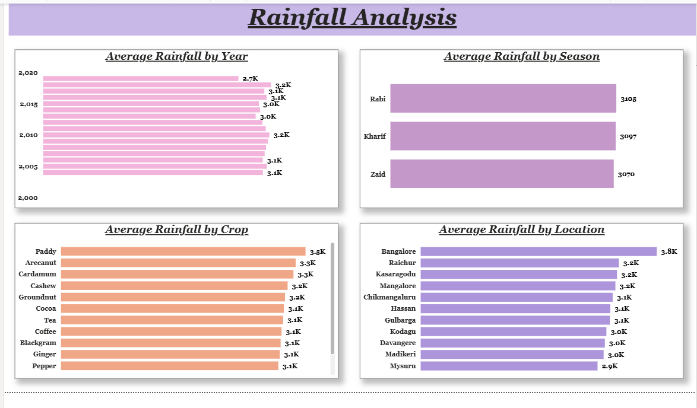
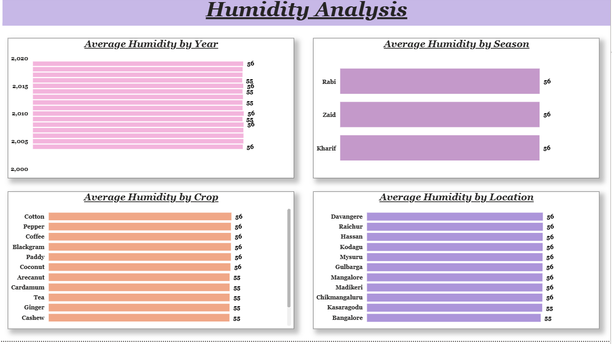
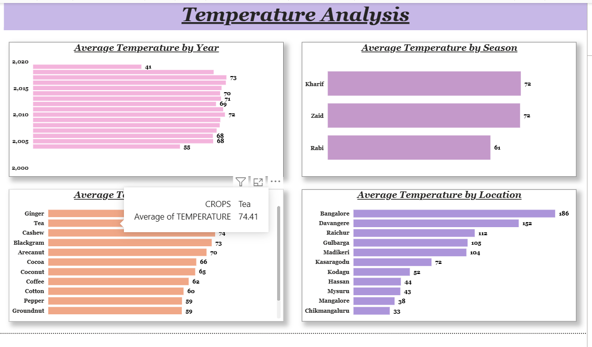
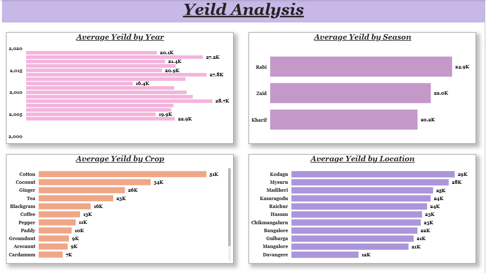

# 🌾 Agriculture Analytics Dashboard using AWS, Snowflake and Power BI


---

## 📌 Project Overview

This project presents an **end-to-end cloud analytics solution** for agriculture data across Karnataka, India, covering crop performance, rainfall trends, temperature variation, humidity patterns, and yield distribution (2004–2020).

The project combines:
- ☁️ **AWS S3** — Cloud storage for raw agriculture data
- ❄️ **Snowflake** — Data warehouse for transformation and querying
- 📊 **Power BI** — 4 interactive agriculture analytics dashboards
- 🌐 **Power BI Service** — Cloud deployment for online access & sharing

> The dataset covers 13 crop types across 11 districts of Karnataka with 3 seasons, transformed in Snowflake before visualization in Power BI.

---

## 🎯 Project Objectives

This project answers key agriculture business questions such as:

- Which crop receives the highest rainfall and which location gets the most?
- How does yield vary across crop types, seasons, and locations?
- Which season and location produce the highest crop yield?
- How does humidity vary across different crops and districts?
- Which year group (Y1/Y2/Y3) shows the best agricultural output?
- How do rainfall categories (Low/Medium/High) relate to crop performance?

---

## 📊 Dashboard Screenshots

### 1. Rainfall Analysis


### 2. Humidity Analysis


### 3. Temperature Analysis


### 4. Yield Analysis


---

## 🛠️ Tools & Technologies

| Tool | Purpose |
|---|---|
| AWS S3 | Cloud storage for raw CSV data |
| Snowflake | Data warehouse, staging, and transformation |
| SQL | Data cleaning, grouping, and categorization |
| Power BI Desktop | Dashboard development |
| Power BI Service | Cloud publishing & sharing |
| DAX | Power BI calculated measures |

---

## ☁️ Cloud Architecture

```
Raw CSV  →  AWS S3  →  Snowflake  →  Power BI Desktop  →  Power BI Service
            (Storage)   (Transform)    (Dashboard)          (Published)
```

---

## ⚙️ Project Workflow

### Step 1 — Data Preparation
The raw agriculture dataset (`agriculture_data.csv`) was prepared with 3,160 records covering Karnataka districts from 2004 to 2020.

### Step 2 — AWS S3 Integration
The CSV was uploaded to an S3 bucket (`s3://powerbi-aws-project/`). A Snowflake storage integration (`PBI_Integration`) was configured using an IAM role ARN to allow secure access from Snowflake to S3.

```sql
CREATE OR REPLACE STORAGE INTEGRATION PBI_Integration
  TYPE = EXTERNAL_STAGE
  STORAGE_PROVIDER = 'S3'
  ENABLED = TRUE
  STORAGE_AWS_ROLE_ARN = 'arn:aws:iam::642528006770:role/powerbi-role'
  STORAGE_ALLOWED_LOCATIONS = ('s3://powerbi-aws-project/');
```

### Step 3 — Snowflake Transformation
Data was loaded via an external stage and transformed with derived columns:

```sql
-- Load data from S3 stage
COPY INTO PBI_Dataset FROM @pbi_stage
FILE_FORMAT = (TYPE=CSV FIELD_DELIMITER=',' SKIP_HEADER=1)
ON_ERROR = 'continue';

-- Year grouping
ALTER TABLE agriculture ADD year_group STRING;
UPDATE agriculture SET year_group = 'Y1' WHERE year BETWEEN 2004 AND 2009;
UPDATE agriculture SET year_group = 'Y2' WHERE year BETWEEN 2010 AND 2015;
UPDATE agriculture SET year_group = 'Y3' WHERE year BETWEEN 2016 AND 2019;

-- Rainfall categorization
ALTER TABLE agriculture ADD rainfall_group STRING;
UPDATE agriculture SET rainfall_group = 'Low'    WHERE rainfall < 1200;
UPDATE agriculture SET rainfall_group = 'Medium' WHERE rainfall BETWEEN 1200 AND 2800;
UPDATE agriculture SET rainfall_group = 'High'   WHERE rainfall > 2800;
```

### Step 4 — Power BI Dashboard Development
Power BI Desktop was connected to the Snowflake `agriculture` table. Four analysis pages were built, each with a consistent 2×2 chart layout sliced by year, season, crop, and location.

### Step 5 — Power BI Service Publishing
The completed report was published to Power BI Service for cloud access and sharing.

**View Live Dashboard:** [Click here to open in Power BI Service](https://app.powerbi.com/groups/321f103f-9ac6-40b5-a8f4-b0762b881b7a/reports/c5182c6f-6e42-4ed4-a6e9-22a52681049e/42dfafb690110ea70e8f?experience=power-bi)

> ⚠️ To generate a safe public link: Power BI Service → File → Embed Report → Publish to web (public) → Copy the iframe/link

---

## 📁 Project Structure

```
agriculture-analytics-aws-snowflake-powerbi/
│
├── dataset/
│   └── agriculture_data.csv                  ← Raw agriculture dataset (3160 rows)
│
├── snowflake_queries/
│   └── snowflake_queries.sql                 ← All Snowflake SQL queries
│
├── screenshots/
│   ├── Rainfall_Analysis.png
│   ├── Humidity_Analysis.png
│   ├── Tempercture_Analysis.png
│   └── Yeild_Analysis.png
│
├── Agriculture_Analytics_Dashboard.pbix      ← Power BI dashboard file
└── README.md
```

---

## 📋 Dataset Description

The dataset contains **3,160 records** with **12 columns** covering Karnataka agriculture data from 2004 to 2020:

| Column | Type | Description |
|---|---|---|
| Year | int | Harvest year (2004–2020) |
| Location | string | District in Karnataka (11 locations) |
| Area | int | Cultivated area in hectares |
| Rainfall | float | Annual rainfall in mm (255–4,103) |
| Temperature | float | Average temperature in °C |
| Soil_type | string | Alluvial / Black / Red / Loam |
| Irrigation | string | Drip / Basin / Spray |
| Yeilds | int | Crop yield in kg/hectare |
| Humidity | float | Relative humidity % (50–60) |
| Crops | string | Crop name (13 crop types) |
| Price | int | Market price of crop |
| Season | string | Kharif / Rabi / Zaid |

**Locations covered:** Bangalore, Chikmangaluru, Davangere, Gulbarga, Hassan, Kasaragodu, Kodagu, Madikeri, Mangalore, Mysuru, Raichur

**Crops covered:** Arecanut, Blackgram, Cardamum, Cashew, Cocoa, Coconut, Coffee, Cotton, Ginger, Groundnut, Paddy, Pepper, Tea

---

## 💡 Key Data Transformation Logic

### Year Group Categorization

```sql
Y1  →  2004 to 2009   (early period)
Y2  →  2010 to 2015   (mid period)
Y3  →  2016 to 2019   (recent period)
```

### Rainfall Group Categorization

```sql
Low     →  Rainfall < 1,200 mm
Medium  →  Rainfall between 1,200 mm and 2,800 mm
High    →  Rainfall > 2,800 mm

Dataset range: 255 mm (minimum) to 4,103 mm (maximum)
```

### Data Adjustments Applied in Snowflake

```sql
-- Rainfall scaled up by 10%
UPDATE agriculture SET rainfall = 1.1 * rainfall;

-- Area scaled down by 10%
UPDATE agriculture SET area = 0.9 * area;
```

---

## 📈 Power BI Dashboards

### Dashboard 1 — Rainfall Analysis
> Rainfall distribution across year, season, crop, and location

**Visuals:**
- Average Rainfall by Year (Bar Chart)
- Average Rainfall by Season (Bar Chart)
- Average Rainfall by Crop (Bar Chart)
- Average Rainfall by Location (Bar Chart)

**Key Insights:**
- 🌧️ Paddy has the highest rainfall requirement by crop (3.5K mm)
- 📍 Bangalore receives the most rainfall by location (3.8K mm)
- 🌱 Rabi season shows the highest average rainfall (3,105 mm)
- 📅 Rainfall is relatively stable across years with a slight dip in 2020

---

### Dashboard 2 — Humidity Analysis
> Humidity pattern analysis across year, season, crop, and location

**Visuals:**
- Average Humidity by Year (Bar Chart)
- Average Humidity by Season (Bar Chart)
- Average Humidity by Crop (Bar Chart)
- Average Humidity by Location (Bar Chart)

**Key Insights:**
- 💧 Humidity stays in a narrow band of 50%–60% across all dimensions
- 🌾 Cotton and Pepper show the highest average humidity (56%)
- 📍 All locations maintain similar humidity levels (55–56%)
- 🌦️ All three seasons show identical average humidity (56%)

---

### Dashboard 3 — Temperature Analysis
> Temperature variation across year, season, crop, and location

**Visuals:**
- Average Temperature by Year (Bar Chart)
- Average Temperature by Season (Bar Chart)
- Average Temperature by Crop (Bar Chart)
- Average Temperature by Location (Bar Chart)

**Key Insights:**
- 🌡️ Kharif and Zaid seasons are the hottest (avg temp 72)
- ❄️ Rabi is the coolest season (avg temp 61)
- 🌿 Ginger and Tea are grown in the highest-temperature conditions
- 📅 Temperature peaked around the 2010–2012 period

---

### Dashboard 4 — Yield Analysis
> Crop yield distribution across year, season, crop, and location

**Visuals:**
- Average Yield by Year (Bar Chart)
- Average Yield by Season (Bar Chart)
- Average Yield by Crop (Bar Chart)
- Average Yield by Location (Bar Chart)

**Key Insights:**
- 🏆 Cotton leads all crops in yield (51K kg/ha average)
- 🥥 Coconut is second highest at 34K kg/ha
- 📍 Kodagu is the highest-yielding location (29K)
- 🌾 Rabi season delivers the best average yield (24.9K)
- 📅 Year 2010 shows the highest single-year peak yield (28.7K)

---

## 📐 Key DAX Measures

```DAX
-- Average Rainfall
Avg Rainfall = AVERAGE('agriculture'[Rainfall])

-- Average Yield
Avg Yield = AVERAGE('agriculture'[Yeilds])

-- Average Temperature
Avg Temperature = AVERAGE('agriculture'[Temperature])

-- Average Humidity
Avg Humidity = AVERAGE('agriculture'[Humidity])

-- Total Cultivated Area
Total Area = SUM('agriculture'[Area])
```

---

## 🔍 Key Findings

| # | Finding | Result |
|---|---|---|
| 1 | Highest yielding crop | Cotton (51K kg/ha) |
| 2 | Highest rainfall crop | Paddy (3.5K mm avg) |
| 3 | Best yield season | Rabi (24.9K avg yield) |
| 4 | Best yield location | Kodagu (29K avg yield) |
| 5 | Highest rainfall location | Bangalore (3.8K mm) |
| 6 | Rainfall range | 255 mm (Low) to 4,103 mm (High) |
| 7 | Humidity range | 50% to 60% (narrow band) |
| 8 | Hottest season | Kharif & Zaid (avg temp 72) |
| 9 | Coolest season | Rabi (avg temp 61) |
| 10 | Year groups created | Y1 (2004–09), Y2 (2010–15), Y3 (2016–19) |

---

## 🚀 Future Improvements

- [ ] Fix temperature data quality issues (767 rows with outlier values)
- [ ] Add interactive slicers for crop, season, and year group filtering
- [ ] Add a summary overview page with KPI cards
- [ ] Add Price Analysis page (revenue = yield × price)
- [ ] Add Soil Type and Irrigation method analysis
- [ ] Add crop yield forecasting using time-series model
- [ ] Replace bar charts with line charts for year-over-year trend analysis
- [ ] Connect live Snowflake data source for real-time refresh

---

## 👤 Author

**Abhishek Kumar**

[](https://linkedin.com/in/abhishek-kumar-a53b46309)
[](https://github.com/abhi14324)
[](mailto:ak38022246637@gmail.com)

---

## 📄 License

This project is open source and available under the [MIT License](LICENSE).

---

> ⭐ If you found this project helpful, please give it a star on GitHub!
